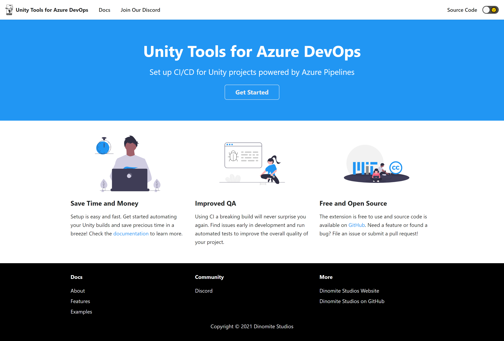

# Unity Tools for Azure DevOps Documentation

[](https://www.unitydevops.com)

This repository contains the documentation website for [Unity Tools for Azure DevOps](https://marketplace.visualstudio.com/items?itemName=DinomiteStudios.64e90d50-a9c0-11e8-a356-d3eab7857116). A collection of tools and tasks for working with Unity based projects on Azure DevOps. The website is built using [Docusaurus 2](https://v2.docusaurus.io/), a modern static website generator.

## Branches

| Branch      | Description                                                                                                 | Status                                                                                                                                                          |
| ----------- | ----------------------------------------------------------------------------------------------------------- | --------------------------------------------------------------------------------------------------------------------------------------------------------------- |
| main        | The main branch is build and deployed to [www.unitydevops.com](https://www.unitydevops.com)                 |         |
| development | This branch contains latest in development features, fixes and changes and is merged to `main` once stable. |  |

## Contributions

Found and fixed a bug or improved on something? Contributions are welcome! Please target your pull request
against the `development` branch.

## Development Instructions

### Installation

```console
npm install
```

### Local Development

```console
npm run start
```

This command starts a local development server and open up a browser window. Most changes are reflected live without having to restart the server.

### Build

```console
npm run build
```

This command generates static content into the `build` directory and can be served using any static contents hosting service.

### Deployment

The website is deployed via CI/CD when a pull request to the `main` branch has been merged.