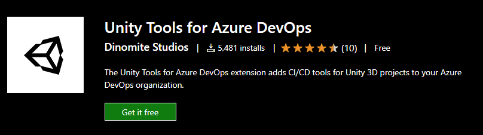
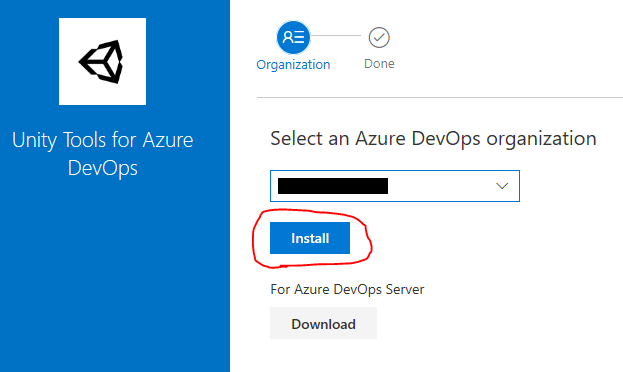

# Install the extension to your DevOps organization

:::note

This documentation assumes you have some knowledge of setting up pipelines using Azure DevOps/Pipelines. If you have questions beyond the scope of this documentation check out this [guide](https://docs.microsoft.com/en-us/azure/devops/pipelines/create-first-pipeline?view=azure-devops&tabs=java%2Ctfs-2018-2%2Cbrowser) to get started with your first Azure Pipeline or join our [Discord](https://discord.gg/RpHSpxkEP6) to find help.

:::

The extension is published to the Visual Studio Marketplace and can be installed from there:

1. Open the extension [Unity Tools for Azure DevOps](https://marketplace.visualstudio.com/items?itemName=DinomiteStudios.64e90d50-a9c0-11e8-a356-d3eab7857116) in the marketplace and select `Get it free` to start the installation process.
   
   

2. Select the Azure DevOps organization you want to install the extension to and proceed by selecting `Install`. *(You may also download the extension if you are using Azure DevOps Server).*
   
   

3. The extension is now installed and you are ready to create your first Unity pipeline.