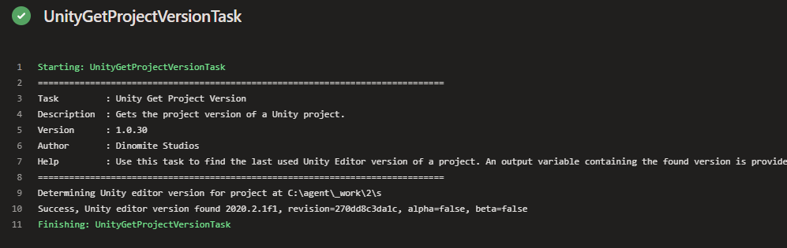

## About

This task will find the Unity Editor version the project was last opened with. This is especially useful
when you need to perform steps in your pipeline that depend on which Unity version is required for the project to build
and run. You can find the task when editing your pipeline by searching for the name `Unity Get Project Version`.

---

## Inputs

This task supports input variables for configuration.

### unityProjectPath

Enter the directory path to the Unity project. If no value is entered, the project is assumed to be in the repository root.

**Required**: No

**Default Value**: -

---

## Outputs

This task provides output variables.

### projectVersion

The project version found by the task for the specified Unity project.

### projectVersionRevision

The Unity editor version revision found by the task for the specified Unity project.

---

## How to use

Here's a simple example of how to use and define the task in your pipeline. For more examples, check the [Examples Collection](./examples.md).

### YAML

In the simple YAML example below we are definiing the task a step in the pipeilne using `- task: UnityGetProjectVersionTask@1`. We are also giving the task a reference name using `name: unitygetprojectversion`, so we can use it to refernce the output variables of the task in other tasks of the pipeline. E.g. we can output the value of the `projectVersion` output variable to the console using `echo $(unitygetprojectversion.projectVersion)`.

```yaml
trigger:
- main

pool:
  name: Unity Windows

steps:
- task: UnityGetProjectVersionTask@1
  name: unitygetprojectversion

- script: |
    echo $(unitygetprojectversion.projectVersion)
```

### Classic Pipeline Editor

The classic (visual) editor for Azure Pipelines provides input fields for configuring the task. In the simple example below, we are leaving the `Unity project path` field empty, since we know our Unity project is in the repository root. We are also assigning a `Reference name` to the task, so we can use it to refernce the output variables in the variables list in other tasks of the pipeline. E.g. to get the value of the `projectVersion` output variable and insert it into any other input field of a task we can then use `$(unitygetprojectversion.projectVersion)`.


import Tabs from '@theme/Tabs';
import TabItem from '@theme/TabItem';

---

## Log

When run and successful the task will provide log output similar to this:

