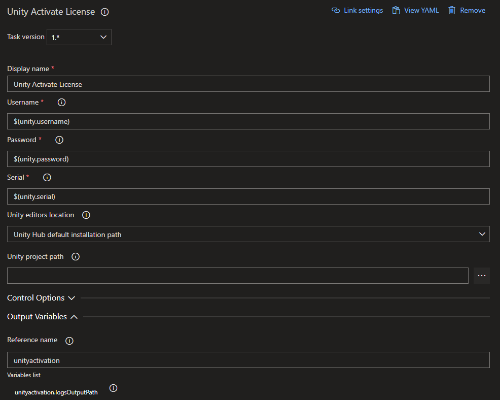
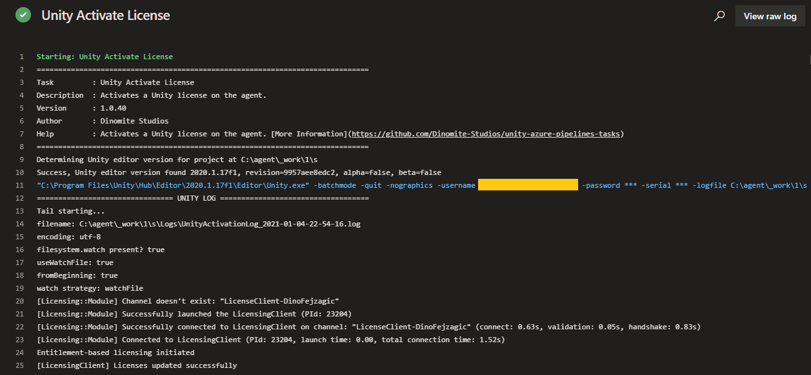

## About

This task is used to activate a Untiy Plus/Pro license on the executing agent machine. You can find the task when editing your pipeline by searching for the name `Unity Activate License`.

---

## Inputs

This task supports input variables for configuration.

### username

The username, generally a mail address, used to activate the license on the machine.

**Required**: Yes

**Default Value**: -

### password

The password for the user specified in the `username` input.

:::warning

Use a secure variable for this input. That way the password will be secured and will not appear in clear text in any log output.

:::

**Required**: Yes

**Default Value**: -

### serial

The Unity Plus/Pro seat serial key used to activate the license on the machine. The seat must have at least one free activation available.
At the time of writing a Unity Plus/Pro seat can be activated on up to two machines. The build task will release the activation every time once
the pipeline has finished.

:::warning

Use a secure variable for this input. That way the serial will be secured and will not appear in clear text in any log output.

:::

**Required**: Yes

**Default Value**: -

### unityEditorsPathMode

For the task to run successfully it needs to know where Unity installations are located at on the agent. This input lets you configure,
where the task should look for installations.

**Required**: Yes

**Default Value**: unityHub

#### Options:

| Value               | Description                                                                                                                                 |
| ------------------- | ------------------------------------------------------------------------------------------------------------------------------------------- |
| unityHub            | Uses the Unity Hub default installation path.                                                                                               |
| environmentVariable | Expects an environment variable `UNITYHUB_EDITORS_FOLDER_LOCATION` to exist on the agent and specifying where to find editor installations. |
| specify             | Let's you specify a custom path where to lookup editor installations using the input `customUnityEditorsPath`.                              |

### customUnityEditorsPath

If you are using a custom buld agent you may want to specify a custom path to specify where to look for Unity installations. This input lets you do that.
Make sure to set `unityEditorsPathMode` to `specify` for this input to take effect.

**Required**: Yes, if `unityEditorsPathMode` set to `specify`

**Default Value**: -

### unityProjectPath

Enter the directory path to the Unity project. If no value is entered, the project is assumed to be in the repository root.

**Required**: No

**Default Value**: -

---

## Outputs

This task provides output variables.

### logsOutputPath

Path to the Unity editor log files generated while executing the task. Use this e.g. to upload logs in case of a failure.

---

## How to use

Here's a simple example of how to use and define the task in your pipeline. For more examples, check the [Examples Collection](./examples.md).

### YAML

In the simple YAML example below we are definiing the task a step in the pipeilne using `- task: UnityActivateLicenseTask@1`. We are also giving the task a reference name using `name: unityactivation`, so we can use it to refernce the output variables of the task in other tasks of the pipeline. E.g. we can output the value of the `logsOutputPath` output variable to the console using `echo $(unityactivation.logsOutputPath)`. For `username`, `password` and `serial` we use shared pipeline variables created previously that contain the user credentials for activating Unity.

```yaml
trigger:
- main

pool:
  name: Unity Windows

variables:
  - group: unity-activation-variables

steps:
- task: UnityActivateLicenseTask@1
  name: unityactivation
  inputs:
    username: $(unity.username)
    password: $(unity.password)
    serial: $(unity.serial)

- script: |
    echo $(unityactivation.logsOutputPath)
```

### Classic Pipeline Editor

The classic (visual) editor for Azure Pipelines provides input fields for configuring the task. In the simple example below, we set variables, which we previously defined, for the `username`, `password` and `serial` inputs. For `Unity editors location` we tell the task to use the default Unity Hub installation path to lookup installed Unity editor versions on the agent running our pipeline. We are also leaving the `Unity project path` field empty, since we know our Unity project is in the repository root. We are also assigning a `Reference name` to the task, so we can use it to refernce the output variables in the variables list in other tasks of the pipeline. E.g. to get the value of the `logsOutputPath` output variable and insert it into any other input field of a task we can then use `$(unityactivation.logsOutputPath)`.



---

## Log

When run and successful the task will provide log output similar to this:

