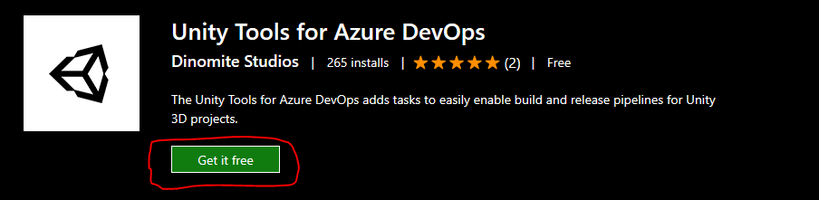
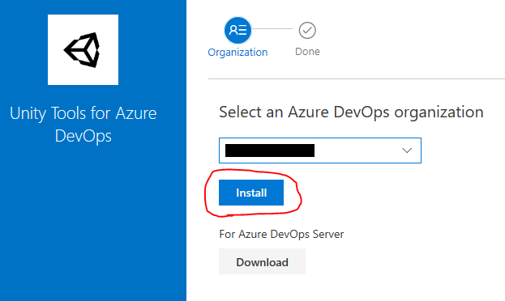

:::note

This documentation assumes you have some knowledge of setting up pipelines using Azure DevOps/Pipelines. If you have questions beyond the scope of this documentation check out this [guide](https://docs.microsoft.com/en-us/azure/devops/pipelines/create-first-pipeline?view=azure-devops&tabs=java%2Ctfs-2018-2%2Cbrowser) to get started with your first Azure Pipeline or join our [Discord](https://discord.gg/RpHSpxkEP6) to find help.

:::

## What is it?

It's an extension to [Azure DevOps](https://azure.microsoft.com/en-us/services/devops/) that adds build and release tasks specifially for [Unity](https://unity.com/) projects. That way it enables implementation of continuous integration and deployment pipelines for an improved workflow that saves time and money.

---

## How to install

The extension is published to the Visual Studio Marketplace and can be installed from there:

1. Open the extension [Unity Tools for Azure DevOps](https://marketplace.visualstudio.com/items?itemName=DinomiteStudios.64e90d50-a9c0-11e8-a356-d3eab7857116) in the marketplace and select `Get it free` to start the installation process.
   
   

2. Select the Azure DevOps organization you want to install the extension to and proceed by selecting `Install`. *(You may also download the extension if you are using Azure DevOps Server).*
   
   

3. The extension is now installed and you are ready to create your first Unity pipeline.

---

## Supported Unity Versions

Unity Tools for Azure DevOps supports building Unity projects starting from `2017.2.0f1` up to the `latest release` of the Unity editor.

---

## Supported Agents

The extension generally supports Microsoft hosted agents as well as custom agents. Some features may not be available when using hosted agents for older Unity versions and platforms that require setting up e.g. specific SDKs on the machine for builds to work. In such cases, we recommend using a custom agent with full control over tools and software installed.

### Supported Platforms for Hosted Agents

- Standalone Windows
- Standalone macOS
- Standalone Linux
- Universal Windows Platform

:::caution

Please note that a Unity Plus / Pro seat with at least one available activation is required to build using hosted agents. This is a requirement by Unity not this extension. The agent will activate the seat on build and release it again once done.

:::

### Supported Platforms for Custom Agents

- All Unity Platforms supported