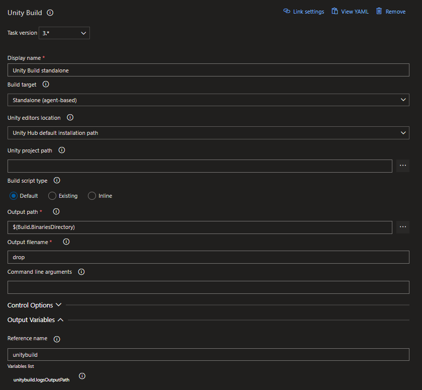
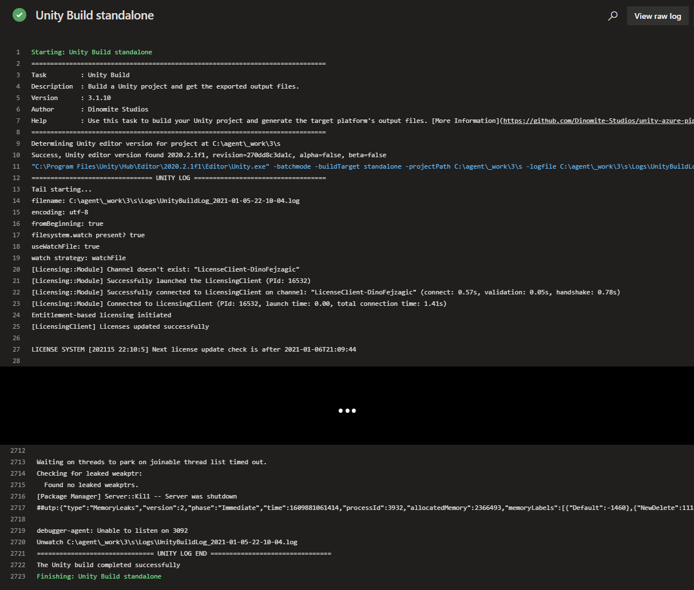

## About

This task is responsible for actually building your Unity project and as such the core task of your pipeline. In many cases it will be the only task you'll need from the collection of tasks this extension provides. Unity Build will build your project and provide the output files for further processing as needed. You can find the task when editing your pipeline by searching for the name `Unity Build`.

:::tip

Note that for backwards compatibility the Azure DevOps extension still provides older versions of the task when installed to your organization. Those versions are out of support and will not recieve any more updates. Please make sure to use `Unity Build V3` in your pipelines!

:::

---

## Inputs

This task supports input variables for configuration.

### buildTarget

Sets the build target platform the Unity build is being made for. All scripts will be compiled against this platform.

**Required**: Yes

**Default Value**: standalone

#### Options:

| Value            | Description                                                                                           |
| ---------------- | ----------------------------------------------------------------------------------------------------- |
| standalone       | Standalone (Windows/macOS/Linux) build. The actual platform is determined by the building agent's OS. |
| Win              | Windows x86 build.                                                                                    |
| Win64            | Windows x64 build.                                                                                    |
| OSXUniversal     | macOS Universal build.                                                                                |
| Linux            | Linux x86 build. Deprecated for Unity 2019.1 and above.                                               |
| Linux64          | Linux x64 build.                                                                                      |
| LinuxUniversal   | Linux Universal build. Deprecated for Unity 2019.1 and above.                                         |
| iOS              | iOS build.                                                                                            |
| Android          | Android build.                                                                                        |
| Web              | Web build.                                                                                            |
| WebStreamed      | Web Streamed build.                                                                                   |
| WebGL            | WebGL build.                                                                                          |
| XboxOne          | Xbox One build.                                                                                       |
| PS4              | Playstation 4 build.                                                                                  |
| WindowsStoreApps | Universal Windows Platform build.                                                                     |
| Switch           | Nintendo Switch build.                                                                                |
| N3DS             | Nintendo 3DS build.                                                                                   |
| tvOS             | tvOS build.                                                                                           |

### unityEditorsPathMode

For the task to run successfully it needs to know where Unity installations are located at on the agent. This input lets you configure,
where the task should look for installations.

**Required**: Yes

**Default Value**: unityHub

#### Options:

| Value               | Description                                                                                                                                 |
| ------------------- | ------------------------------------------------------------------------------------------------------------------------------------------- |
| unityHub            | Uses the Unity Hub default installation path.                                                                                               |
| environmentVariable | Expects an environment variable `UNITYHUB_EDITORS_FOLDER_LOCATION` to exist on the agent and specifying where to find editor installations. |
| specify             | Let's you specify a custom path where to lookup editor installations using the input `customUnityEditorsPath`.                              |

### customUnityEditorsPath

If you are using a custom buld agent you may want to specify a custom path to specify where to look for Unity installations. This input lets you do that.
Make sure to set `unityEditorsPathMode` to `specify` for this input to take effect.

**Required**: Yes, if `unityEditorsPathMode` set to `specify`

**Default Value**: -

### unityProjectPath

Enter the directory path to the Unity project. If no value is entered, the project is assumed to be in the repository root.

**Required**: No

**Default Value**: -

### buildScriptType

Specifies which build script should be executed when the build process is run. A build script is a `C#` script that's placed inside
your Unity project and performs a build. If you don't have your own build script, you can use the default provided with the task.

**Required**: Yes

**Default Value**: default

#### Options:

| Value    | Description                                                                                         |
| -------- | --------------------------------------------------------------------------------------------------- |
| default  | Uses a default build script provided by the task itself that works for most projects and use cases. |
| existing | Use this option to specify your own build script that should be run to execute the build.           |
| inline   | Use this option to specify an inline build script that should be run to execute the build.          |

### inlineBuildScript

If you configured `buildScriptType` to `inline` you can enter your build script in the pipeline itself using this input.
The build script will then get imported to your Unity project when the pipeline runs and be available.

**Required**: Yes, if `buildScriptType` set to `inline`

**Default Value**: -

### scriptExecuteMethod

Specifies the static method to run via command line to build the project. Only relevant when using `buildScriptType` `existing` or `inline`.

**Required**: Yes, if `buildScriptType` set to `existing` or `inline`

**Default Value**: -

### outputPath

Specify the build output path relative to the repository root or fully qualified.

**Required**: Yes

**Default Value**: $(Build.BinariesDirectory)

### outputFileName

Enter the output filename to be used when constructing the platform-appropriate output. For instance, if you want the output to be 'thegame.exe' on Windows Standalone, enter 'thegame'.

**Required**: No

**Default Value**: drop

### additionalCmdArgs

Specify command line arguments to pass to the Unity process when running the task.

:::warning

Many command line arguments the build task will already set for you. If you find you are missing any advanced or custom command line arguments, only then you should
specify them using this input. For most use cases and projects you will not need to add any additional command line arguments.

:::

**Required**: No

**Default Value**: -

#### Options:

Check the official [Unity command line documentation](https://docs.unity3d.com/Manual/CommandLineArguments.html) for options.

---

## Outputs

This task provides output variables.

### logsOutputPath

Path to the Unity editor log files generated while executing the task. Use this e.g. to upload logs in case of a failure.

---

## How to use

Here's a simple example of how to use and define the task in your pipeline. For more examples, check the [Examples Collection](./examples.md).

### YAML

In the simple YAML example below we are definiing the task a step in the pipeilne using `- task: UnityBuildTask@3`. We are also giving the task a reference name using `name: unitybuild`, so we can use it to refernce the output variables of the task in other tasks of the pipeline. E.g. we can output the value of the `logsOutputPath` output variable to the console using `echo $(unitybuild.logsOutputPath)`. For `buildTarget` we specify that Unity should target the `standalone` platform. Our output file will be named `drop.exe` in this example.

```yaml
trigger:
- main

pool:
  name: Unity Windows

steps:
- task: UnityBuildTask@3
  name: unitybuild
  inputs:
    buildTarget: standalone
    outputPath: $(Build.BinariesDirectory)
    outputFileName: drop

- script: |
    echo $(unitybuild.logsOutputPath)
```

### Classic Pipeline Editor

The classic (visual) editor for Azure Pipelines provides input fields for configuring the task. In the simple example below, we set `Build target` to `Standalone (agent-based)`, that means if our pipeline runs on a Windows agent we get a Windows built and if on a mac we'll get a macOS build. We are also assigning a `Reference name` to the task, so we can use it to refernce the output variables in the variables list in other tasks of the pipeline. E.g. to get the value of the `logsOutputPath` output variable and insert it into any other input field of a task we can then use `$(unitybuild.logsOutputPath)`. Everything else we are leaving at the defaults.



---

## Log

When run and successful the task will provide log output similar to this:

