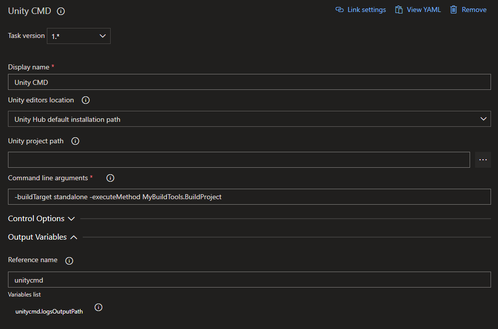
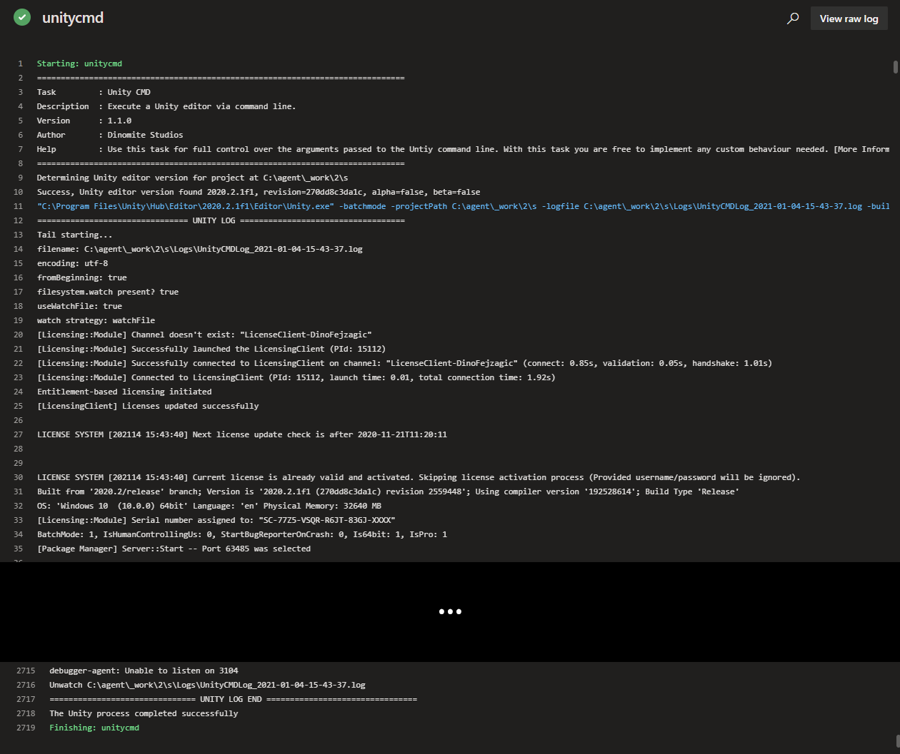

## About

Use the Unity Setup task to install a Unity editor version on the build agent. This is especially useful when working with hosted agents,
where you do not know whether the Unity version your project needs to build is installed on the agent.

---

## Inputs

This task supports input variables for configuration.

### unityEditorsPathMode

For the task to run successfully it needs to know where Unity installations are located at on the agent. This input lets you configure,
where the task should look for installations.

**Required**: Yes

**Default Value**: unityHub

#### Options:

| Value               | Description                                                                                                                                 |
| ------------------- | ------------------------------------------------------------------------------------------------------------------------------------------- |
| unityHub            | Uses the Unity Hub default installation path.                                                                                               |
| environmentVariable | Expects an environment variable `UNITYHUB_EDITORS_FOLDER_LOCATION` to exist on the agent and specifying where to find editor installations. |
| specify             | Let's you specify a custom path where to lookup editor installations using the input `customUnityEditorsPath`.                              |

### customUnityEditorsPath

If you are using a custom buld agent you may want to specify a custom path to specify where to look for Unity installations. This input lets you do that.
Make sure to set `unityEditorsPathMode` to `specify` for this input to take effect.

**Required**: Yes, if `unityEditorsPathMode` set to `specify`

**Default Value**: -

### unityProjectPath

Enter the directory path to the Unity project. If no value is entered, the project is assumed to be in the repository root.

**Required**: No

**Default Value**: -

### cmdArgs

Specify command line arguments to pass to the Unity process when running the task.

:::warning

The task will set `-batchmode`, `-projectPath` and `-logfile` for you and you shouldn't specify them in your custom command line arguments. These three arguments are currently required to be always set for the task to work as designed.

:::

**Required**: Yes

**Default Value**: -

#### Options:

Check the official [Unity command line documentation](https://docs.unity3d.com/Manual/CommandLineArguments.html) for options.

---

## Outputs

This task provides output variables.

### logsOutputPath

Path to the Unity editor log files generated while executing the task. Use this e.g. to upload logs in case of a failure.

---

## How to use

Here's a simple example of how to use and define the task in your pipeline. For more examples, check the [Examples Collection](./examples.md).

### YAML

In the simple YAML example below we are definiing the task a step in the pipeilne using `- task: UnityCMDTask@1`. We are also giving the task a reference name using `name: unitycmd`, so we can use it to refernce the output variables of the task in other tasks of the pipeline. E.g. we can output the value of the `logsOutputPath` output variable to the console using `echo $(unitycmd.logsOutputPath)`. For `cmdArgs` we specify that Unity should target the `standalone` platform and execute our custom build script `MyBuildTools.BuildProject` to perform the build.

```yaml
trigger:
- main

pool:
  name: Unity Windows

steps:
- task: UnityCMDTask@1
  name: unitycmd
  inputs:
    unityEditorsPathMode: unityHub
    cmdArgs: -buildTarget standalone -executeMethod MyBuildTools.BuildProject

- script: |
    echo $(unitycmd.logsOutputPath)
```

### Classic Pipeline Editor

The classic (visual) editor for Azure Pipelines provides input fields for configuring the task. In the simple example below, we set `Unity editors location` to use the default Unity Hub installation path to lookup installed Unity editor versions on the agent running our pipeline. We are also leaving the `Unity project path` field empty, since we know our Unity project is in the repository root. For `Command line arguments` we specify that Unity should target the `standalone` platform and execute our custom build script `MyBuildTools.BuildProject` to perform the build. We are also assigning a `Reference name` to the task, so we can use it to refernce the output variables in the variables list in other tasks of the pipeline. E.g. to get the value of the `logsOutputPath` output variable and insert it into any other input field of a task we can then use `$(unitycmd.logsOutputPath)`.



---

## Log

When run and successful the task will provide log output similar to this:

