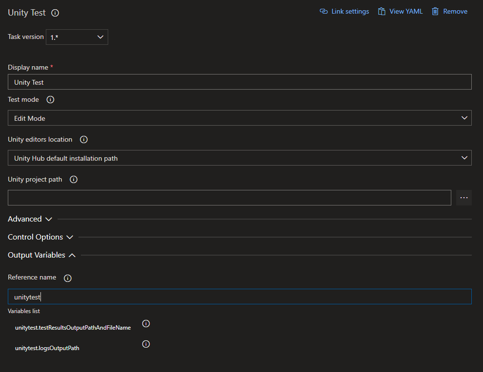
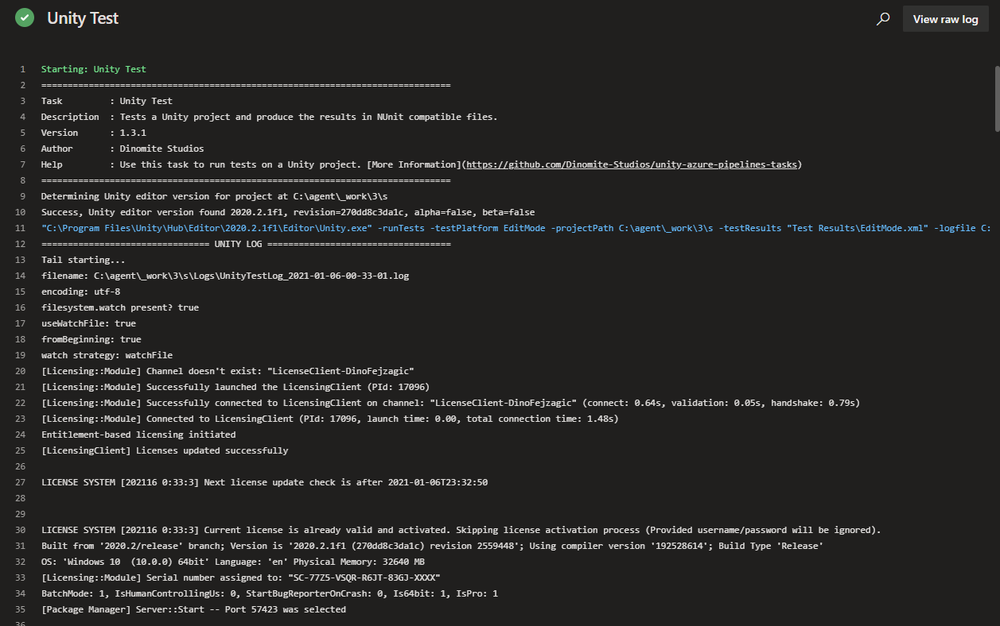

## About

This task is used for running unit tests in your project. Test results will output into a test results file and the file path is provided for uploading and processing. You can find the task when editing your pipeline by searching for the name `Unity Test`.

---

## Inputs

This task supports input variables for configuration.

### testMode

The mode you want to run tests in.

**Required**: Yes

**Default Value**: editMode

#### Options:

| Value    | Description                                                                          |
| -------- | ------------------------------------------------------------------------------------ |
| editMode | Runs tests in edit mode, edit mode tests include the Unity Editor assembly and APIs. |
| playMode | Runs tests in play mode.                                                             |

### unityEditorsPathMode

For the task to run successfully it needs to know where Unity installations are located at on the agent. This input lets you configure,
where the task should look for installations.

**Required**: Yes

**Default Value**: unityHub

#### Options:

| Value               | Description                                                                                                                                 |
| ------------------- | ------------------------------------------------------------------------------------------------------------------------------------------- |
| unityHub            | Uses the Unity Hub default installation path.                                                                                               |
| environmentVariable | Expects an environment variable `UNITYHUB_EDITORS_FOLDER_LOCATION` to exist on the agent and specifying where to find editor installations. |
| specify             | Let's you specify a custom path where to lookup editor installations using the input `customUnityEditorsPath`.                              |

### customUnityEditorsPath

If you are using a custom buld agent you may want to specify a custom path to specify where to look for Unity installations. This input lets you do that.
Make sure to set `unityEditorsPathMode` to `specify` for this input to take effect.

**Required**: Yes, if `unityEditorsPathMode` set to `specify`

**Default Value**: -

### unityVersion

The version number of Unity to use. This is required to avoid any pathing issues, and can be obtained dynamically from using the `UnityGetProjectVersionTask` task.

**Required**: Yes

**Default Value**: -

### unityProjectPath

Enter the directory path to the Unity project. If no value is entered, the project is assumed to be in the repository root.

**Required**: No

**Default Value**: -

### testCategory

A semicolon-separated list of test categories to include in the run. If using both testFilter and testCategory, then tests only run that matches both.

**Required**: No

**Default Value**: -

### testFilter

A semicolon-separated list of test names to run, or a regular expression pattern to match tests by their full name.

**Required**: No

**Default Value**: -

### batchMode

If set, Unity runs in batch mode and disables any UI and popups to fully eliminate the need for human intervention. Note that you cannot use batch mode when testing UI.

**Required**: No

**Default Value**: true

### acceptApiUpdate

If set, the Unity API updater will run before running tests and update any obsolete API usage.

**Required**: No

**Default Value**: false

### noPackageManager

If set, the Unity Package Manager is disabled for the time of task execution.

**Required**: No

**Default Value**: false

### testResultsPath

Tells the task where to output test results. Path can be relative to repository root or absolute.

**Required**: No

**Default Value**: Test Results

### additionalCmdArgs

Specify command line arguments to pass to the Unity process when running the task.

:::warning

Many command line arguments the build task will already set for you. If you find you are missing any advanced or custom command line arguments, only then you should
specify them using this input. For most use cases and projects you will not need to add any additional command line arguments.

:::

**Required**: No

**Default Value**: -

#### Options:

Check the official [Unity command line documentation](https://docs.unity3d.com/Manual/CommandLineArguments.html) for options.

---

## Outputs

This task provides output variables.

### testResultsOutputPathAndFileName

Path and File name of the test results in XML format.

### logsOutputPath

Path to the Unity editor log files generated while executing the task. Use this e.g. to upload logs in case of a failure.

---

## How to use

Here's a simple example of how to use and define the task in your pipeline. For more examples, check the [Examples Collection](./examples.md).

### YAML

In the simple YAML example below we are definiing the task a step in the pipeline using `- task: UnityTestTask@1`. We are also giving the task a reference name using `name: unitytest`, so we can use it to reference the output variables of the task in other tasks of the pipeline. E.g. we can output the value of the `testResultsOutputPathAndFileName` output variable to the console using `echo $(unitytest.testResultsOutputPathAndFileName)`. For `testMode` we specify that we want to run in `editMode`. To avoid any pathing issues, we also need to add a `UnityGetProjectVersionTask` step, and set the `unityVersion` input to `$(unitygetprojectversion.projectVersion)`. Everything else we are leaving at the defaults.

```yaml
trigger:
- main

pool:
  name: Unity Windows

steps:
- task: UnityGetProjectVersionTask@1
  name: unitygetprojectversion

- task: UnityTestTask@1
  name: unitytest
  inputs:
    unityVersion: $(unitygetprojectversion.projectVersion)
    testMode: editMode

- script: |
    echo $(unitytest.testResultsOutputPathAndFileName)
```

### Classic Pipeline Editor

The classic (visual) editor for Azure Pipelines provides input fields for configuring the task. In the simple example below, we set `Test mode` to `Edit Mode`, that means we are running tests that will also include the Unity Editor assembly and APIs. This is e.g. useful when testing editor extensions. We are also assigning a `Reference name` to the task, so we can use it to refernce the output variables in the variables list in other tasks of the pipeline. E.g. to get the value of the `testResultsOutputPathAndFileName` output variable and insert it into any other input field of a task we can then use `$(unitytest.testResultsOutputPathAndFileName)`. To avoid any pathing issues, we also need to add a `UnityGetProjectVersionTask` step, and set the `unityVersion` input to `$(unitygetprojectversion.projectVersion)`. Everything else we are leaving at the defaults.



---

## Log

When run and successful the task will provide log output similar to this:


